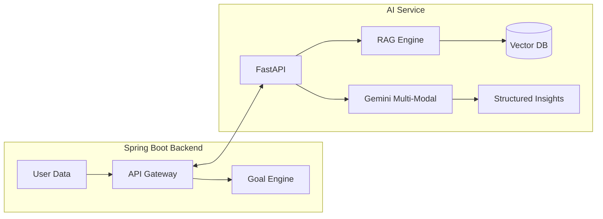

# Full System Improvement Roadmap: Backend & AI Service

This plan outlines enhancements for the Spring Boot backend and Python AI service to support advanced health coaching and data intelligence.

## 1. Spring Boot Backend Enhancements

### A. Health Goals & Achievement System
- **Goal Entities**: Create new entities for `HealthGoal` (e.g., target weight, daily steps, weekly workout frequency).
- **Goal Tracking API**: Endpoints to set, update, and track progress against these goals.
- **Achievement Engine**: A background service that evaluates user data daily and awards virtual "Achievements" or "Streaks" to drive engagement.

### B. Expanded Medical Intelligence
- **Biomarker Expansion**: Update `LabValues` entity and DTOs to include:
    - Liver Profile: ALT, AST, Bilirubin
    - Metabolic: Fasting Glucose, Insulin
    - Hormonal: Testosterone (Total/Free), Cortisol
    - CBC: RBC, WBC, Platelets
- **Reference Range Mapping**: Add a metadata layer that stores standard reference ranges for these biomarkers (age and gender-specific).

### C. Enhanced Data Aggregation
- **Time-Series Optimization**: Refactor `HealthSummaryService` to use more efficient JPA queries for long-term trend calculations.
- **Caching**: Implement Spring Cache (Redis or caffeine) for heavy AI-generated summaries to reduce latency.

## 2. Python AI Service Enhancements

### A. RAG-Enabled Personalized Coaching
- **Knowledge Base**: Integrate a vector database (e.g., FAISS or ChromaDB) with curated health and nutrition literature.
- **Retrieval Context**: When generating recommendations, the AI will retrieve relevant scientific context based on the user's specific risk flags (e.g., "Best diet for high LDL").
- **Persona Persistence**: Refine the prompt to maintain a consistent "Coach Persona" that remembers user preferences.

### B. Multi-Modal Medical Parsing
- **Direct Vision Analysis**: Move beyond `text_extract.py`. Send report images/PDFs directly to Gemini's vision model to extract data from tables and complex layouts that OCR often misses.
- **Validation Layer**: Implement a cross-check between vision-extracted data and regex-parsed text for higher accuracy.

### C. Proactive Risk Analysis
- **Predictive Flags**: Instead of just "Plateau detected", use the AI to predict potential issues based on current trajectory (e.g., "At your current rate, you might reach your target weight in X weeks").

---

### Mermaid: Enhanced AI Architecture

