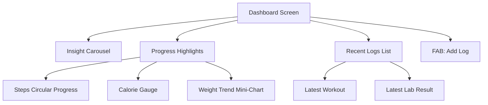

# Mobile UI/UX & Data Visualization Improvement Plan

Focusing on enhancing the user experience and making health data more actionable through better visualization in the Flutter mobile app.

## 1. Dashboard Redesign (Home Screen)
Currently, the dashboard is a simple list of action cards. We will transform it into a "Health at a Glance" command center.

- **Dynamic Summary Widgets**: Add small charts for "Calories Remaining", "Steps Progress (Circular)", and "Last Workout".
- **Insight Carousel**: A horizontal scrolling section at the top displaying AI-generated insights (e.g., "You've hit your protein goal 3 days in a row!").
- **Quick Action FAB**: Move "Add" actions to a floating action button to clean up screen space.

## 2. Advanced Trend Analysis
The current trend screen only shows a basic weight line chart.

- **Multi-Metric Overlays**: Allow users to overlay different metrics (e.g., Weight vs. Caloric Intake) to see correlations.
- **Interactive Tooltips**: Use `fl_chart` features to show exact values and dates when tapping on chart points.
- **Time Range Selectors**: Add clear buttons for 7D, 30D, 3M, and 1Y views.
- **Color Coding**: Use color gradients (Green for improvement, Red for attention) on chart lines and background regions.

## 3. Medical Report Visualization
Transform raw lab numbers into visual indicators.

- **Range Gauges**: For each biomarker (Vitamin D, LDL, etc.), show a horizontal bar indicating the "Healthy Range" and where the user's current value sits.
- **Historical Comparison**: A vertical timeline view of lab results to see long-term changes in biomarkers.

## 4. UI/UX Refinement
- **Theming**: Ensure consistent use of the `AppTheme` across all features, especially custom chart colors.
- **Empty States**: Design better "No Data" states that encourage users to start logging.
- **Skeleton Loaders**: Replace the simple `CircularProgressIndicator` with skeleton loaders for a smoother perceived performance.

## 5. Technical Implementation Details (Flutter)
- **State Management**: Utilize Riverpod `FutureProvider` and `StreamProvider` for real-time dashboard updates.
- **Charting**: Deep dive into `fl_chart` configuration for custom touch handling and styling.
- **Custom Widgets**: Create reusable components for `MetricGauge` and `InsightCard`.

---

### Mermaid: New Dashboard Architecture

